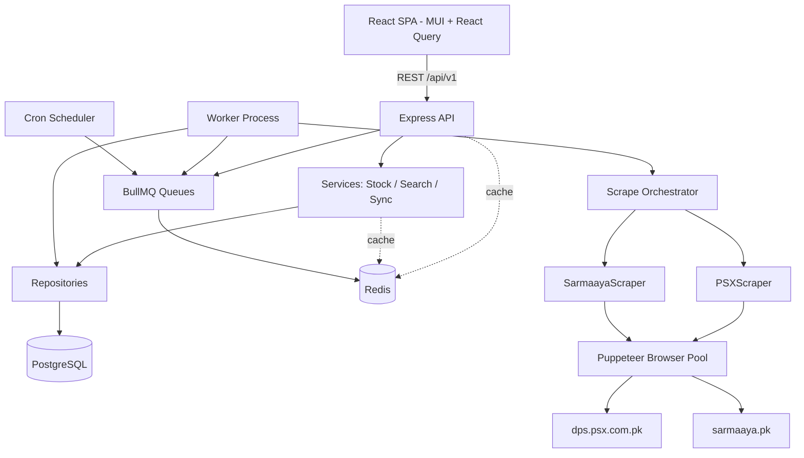
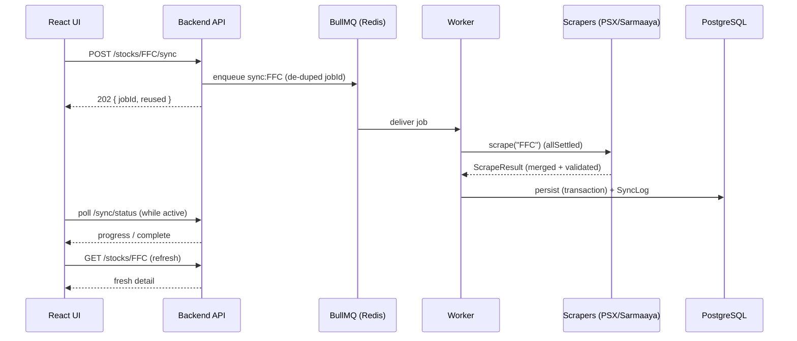
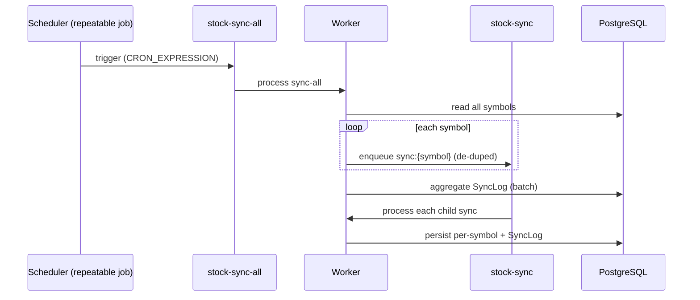
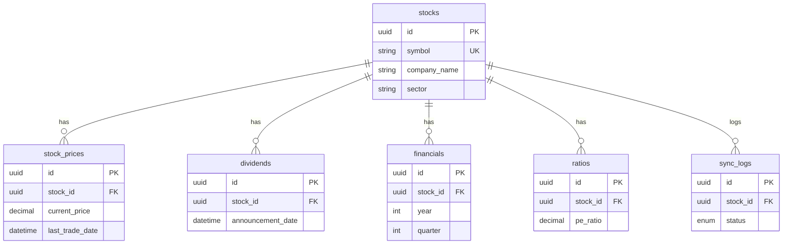

# Architecture & Sequence Diagrams

## System architecture

```mermaid
graph TD
    UI[React SPA - MUI + React Query] -->|REST /api/v1| API[Express API]
    API --> SVC[Services: Stock / Search / Sync]
    SVC --> REPO[Repositories]
    REPO --> PG[(PostgreSQL)]
    API --> REDISQ[BullMQ Queues]
    API -. cache .-> REDIS[(Redis)]
    SVC -. cache .-> REDIS
    REDISQ --> REDIS
    WORKER[Worker Process] --> REDISQ
    WORKER --> ORCH[Scrape Orchestrator]
    ORCH --> PSX[PSXScraper]
    ORCH --> SARM[SarmaayaScraper]
    PSX --> POOL[Puppeteer Browser Pool]
    SARM --> POOL
    POOL --> WEB1[dps.psx.com.pk]
    POOL --> WEB2[sarmaaya.pk]
    WORKER --> REPO
    SCHED[Cron Scheduler] --> REDISQ
```

## Sequence — On-demand "Sync Latest Data"

```mermaid
sequenceDiagram
    participant UI as React UI
    participant API as Backend API
    participant Q as BullMQ (Redis)
    participant W as Worker
    participant S as Scrapers (PSX/Sarmaaya)
    participant DB as PostgreSQL
    UI->>API: POST /stocks/FFC/sync
    API->>Q: enqueue sync:FFC (de-duped jobId)
    API-->>UI: 202 { jobId, reused }
    Q->>W: deliver job
    W->>S: scrape("FFC") (allSettled)
    S-->>W: ScrapeResult (merged + validated)
    W->>DB: persist (transaction) + SyncLog
    UI->>API: poll /sync/status (while active)
    API-->>UI: progress / complete
    UI->>API: GET /stocks/FFC (refresh)
    API-->>UI: fresh detail
```

## Sequence — Hourly automatic sync (fan-out)

```mermaid
sequenceDiagram
    participant Cron as Scheduler (repeatable job)
    participant QA as stock-sync-all
    participant W as Worker
    participant Q as stock-sync
    participant DB as PostgreSQL
    Cron->>QA: trigger (CRON_EXPRESSION)
    QA->>W: process sync-all
    W->>DB: read all symbols
    loop each symbol
        W->>Q: enqueue sync:{symbol} (de-duped)
    end
    W->>DB: aggregate SyncLog (batch)
    Q->>W: process each child sync
    W->>DB: persist per-symbol + SyncLog
```

## ER diagram

```mermaid
erDiagram
    stocks ||--o{ stock_prices : has
    stocks ||--o{ dividends : has
    stocks ||--o{ financials : has
    stocks ||--o{ ratios : has
    stocks ||--o{ sync_logs : logs
    stocks {
      uuid id PK
      string symbol UK
      string company_name
      string sector
    }
    stock_prices {
      uuid id PK
      uuid stock_id FK
      decimal current_price
      datetime last_trade_date
    }
    financials {
      uuid id PK
      uuid stock_id FK
      int year
      int quarter
    }
    dividends {
      uuid id PK
      uuid stock_id FK
      datetime announcement_date
    }
    ratios {
      uuid id PK
      uuid stock_id FK
      decimal pe_ratio
    }
    sync_logs {
      uuid id PK
      uuid stock_id FK
      enum status
    }
```
