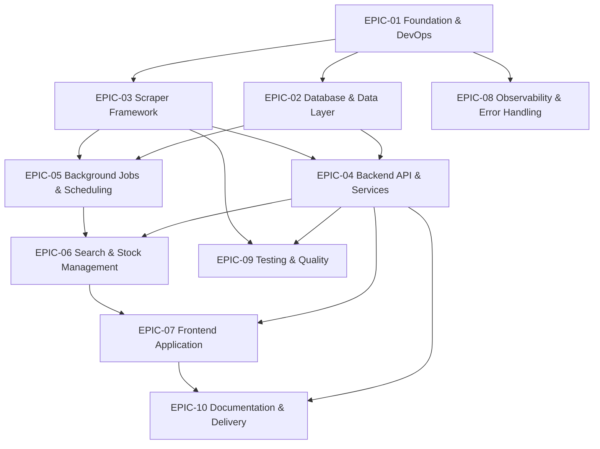

# PSX Stock Scraper & Portfolio Backend — Product Backlog

> Epic → Story → Task breakdown for the PSX Stock Data Scraper & Portfolio Backend.
> Source of truth: [`PSX_Stock_Scraper_Project_Prompt.md`](../PSX_Stock_Scraper_Project_Prompt.md)

## 1. How this backlog is organized

```
tasks/
├── README.md                  ← this file (overview, roadmap, conventions)
├── backlog.csv                ← Jira / Azure DevOps import file (all issues)
└── epics/
    ├── EPIC-01-foundation-devops.md
    ├── EPIC-02-database-data-layer.md
    ├── EPIC-03-scraper-framework.md
    ├── EPIC-04-backend-api-services.md
    ├── EPIC-05-background-jobs-scheduling.md
    ├── EPIC-06-search-stock-management.md
    ├── EPIC-07-frontend-application.md
    ├── EPIC-08-observability-error-handling.md
    ├── EPIC-09-testing-quality.md
    └── EPIC-10-documentation-delivery.md
```

Every epic file follows the same structure: **Goal → Stories → (per story) Acceptance Criteria, Tasks, Story Points, Dependencies, Technical Notes.**

## 2. Estimation legend

Story points use a modified Fibonacci scale (relative complexity, not hours):

| Points | Meaning | Rough calendar guide (1 senior dev) |
|-------:|---------|-------------------------------------|
| 1 | Trivial, well-understood | < half day |
| 2 | Small, isolated | ~half day |
| 3 | Standard story, some unknowns | ~1 day |
| 5 | Meaningful, multiple moving parts | ~2–3 days |
| 8 | Large, cross-cutting or risky | ~1 week |
| 13 | Very large — should usually be split | > 1 week |

Priority: **P0** (blocker / must-have for MVP), **P1** (should-have), **P2** (nice-to-have / later).

## 3. Epic summary

| Epic | Title | Focus | Points | Priority |
|------|-------|-------|-------:|:--------:|
| EPIC-01 | Foundation & DevOps | Monorepo, TypeScript, tooling, Docker Compose, env config | 29 | P0 |
| EPIC-02 | Database & Data Layer | Prisma schema, migrations, repositories, indexes | 32 | P0 |
| EPIC-03 | Scraper Framework | Pluggable interface, PSX + Sarmaaya scrapers, Puppeteer infra | 47 | P0 |
| EPIC-04 | Backend API & Services | Controllers, services, routes, Zod validation, Swagger | 42 | P0 |
| EPIC-05 | Background Jobs & Scheduling | BullMQ queues, workers, cron, retry/backoff | 34 | P0 |
| EPIC-06 | Search & Stock Management | Search API + caching, add/delete stock, on-demand sync | 26 | P1 |
| EPIC-07 | Frontend Application | React/Vite, 4 pages, React Query, dark mode, responsive | 55 | P1 |
| EPIC-08 | Observability & Error Handling | Winston logging, metrics, global error handling | 21 | P1 |
| EPIC-09 | Testing & Quality | Unit, integration, scraper, API tests (Jest) | 34 | P1 |
| EPIC-10 | Documentation & Delivery | README, diagrams, Swagger, deployment guide | 21 | P2 |
| **Total** | | | **341** | |

## 4. Dependency map



## 5. Suggested release roadmap

**Sprint 0 — Foundation (EPIC-01):** repo, tooling, Docker Compose skeleton, env contracts. Everything else builds on this.

**Sprint 1 — Data + Scraping core (EPIC-02, EPIC-03):** Prisma schema and repositories; pluggable scraper interface with PSX and Sarmaaya implementations behind it. Highest technical risk lives here — sequence it early.

**Sprint 2 — API + Jobs (EPIC-04, EPIC-05):** REST surface with Zod validation and Swagger; BullMQ queues, worker, and hourly scheduler with retry/backoff.

**Sprint 3 — Features + Observability (EPIC-06, EPIC-08):** search + caching, add/delete stock, on-demand sync; Winston logging, metrics, and global error handling threaded through the app.

**Sprint 4 — Frontend (EPIC-07):** four pages wired to the API via React Query, dark mode, responsive layout.

**Sprint 5 — Hardening (EPIC-09, EPIC-10):** test coverage across layers, documentation, diagrams, deployment guide, release.

## 6. Cross-cutting assumptions

- Single-region deployment; no multi-tenant / auth requirements are stated, so the MVP is treated as an internal/trusted tool. An **Auth & RBAC** epic is called out as a future add (see EPIC-10 open questions) but is **out of scope** here.
- Scraping targets (`dps.psx.com.pk`, `sarmaaya.pk`) are third-party sites with no public API contract; HTML structure **will** drift, so the scraper framework treats selector fragility as a first-class concern.
- Data volume is modest (hundreds–low thousands of PSX symbols, hourly cadence). PostgreSQL on a single primary is sufficient; no sharding/read-replica work is scoped.
- No paid third-party services assumed beyond self-hosted PostgreSQL + Redis via Docker Compose.

## 7. Global risks

| Risk | Impact | Mitigation |
|------|--------|-----------|
| Scraper selectors break when source sites change markup | High | Provider-per-scraper isolation, selector config, schema validation on parsed output, alerting on parse failures (EPIC-03, EPIC-08) |
| Anti-bot / rate limiting on source sites | High | Configurable concurrency + delays, retry with backoff, single shared browser pool (EPIC-03, EPIC-05) |
| Duplicate/overlapping sync jobs | Medium | Job de-duplication keys in BullMQ, unique constraints in DB (EPIC-05, EPIC-02) |
| Puppeteer footprint in containers (memory/Chromium deps) | Medium | Dedicated worker image, resource limits, headless flags (EPIC-01, EPIC-03) |
| Data-shape mismatch between the two providers | Medium | Normalize to canonical DTOs before persistence (EPIC-03, EPIC-04) |
