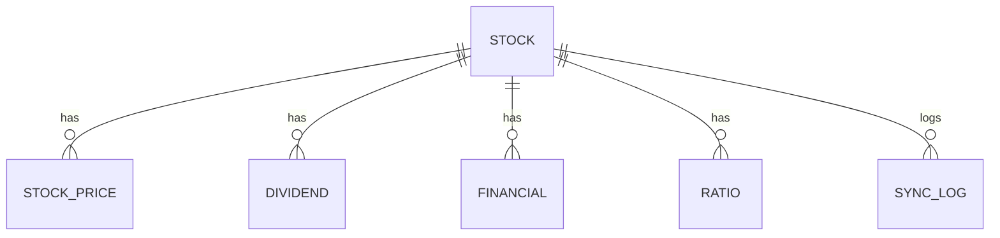
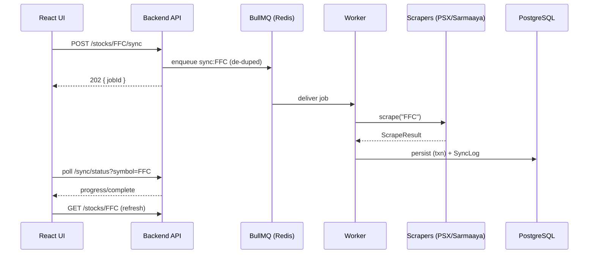

# EPIC-10 — Documentation & Delivery

**Priority:** P2 · **Total points:** 21 · **Depends on:** EPIC-04, EPIC-07

## Goal
Produce the documentation deliverables (README, installation/Docker guide, API docs, ER/architecture/sequence diagrams, deployment guide) and package the system for a clean, reproducible handover. "Done" means a new engineer can stand up and understand the whole system from the repo alone.

---

## STORY-10.1 — README & installation guide
**Points:** 3 · **Priority:** P2 · **Depends on:** EPIC-01

**Acceptance Criteria**
- Root README covers project overview, stack, prerequisites, quickstart (`docker compose up`), local dev (non-Docker) setup, env var reference, and common commands.
- Separate installation guide for first-time setup incl. Node LTS, Docker, and troubleshooting.

**Tasks**
- [ ] Write README (overview, stack, quickstart, scripts).
- [ ] Write installation guide + troubleshooting section.
- [ ] Document all env vars (backend + frontend) with defaults.

**Technical Notes:** Pull env reference from EPIC-01 STORY-01.6 `.env.example` files to stay in sync.

---

## STORY-10.2 — Docker & deployment guide
**Points:** 5 · **Priority:** P2 · **Depends on:** EPIC-01 (STORY-01.5), EPIC-02 (STORY-02.7)

**Acceptance Criteria**
- Guide explains the compose topology (frontend, backend, worker, postgres, redis), volumes, healthchecks, and prod vs dev overrides.
- Migration workflow on deploy documented (`migrate deploy` on start).
- Scaling notes (separate worker scaling), resource sizing for Puppeteer, and backup/restore basics.

**Tasks**
- [ ] Document compose topology + service responsibilities.
- [ ] Document migration-on-deploy and rollback.
- [ ] Add scaling + resource + backup guidance.

**Technical Notes:** Call out that the worker (Puppeteer) scales independently from the API and is the memory-heavy service.

---

## STORY-10.3 — API documentation (Swagger/OpenAPI)
**Points:** 3 · **Priority:** P2 · **Depends on:** EPIC-04 (STORY-04.8)

**Acceptance Criteria**
- Published, browsable API docs (Swagger UI at `/api/docs`) plus an exported `openapi.json` committed to the repo.
- Every endpoint, schema, and error response documented; examples included.

**Tasks**
- [ ] Finalize/annotate the OpenAPI spec; add examples.
- [ ] Commit exported `openapi.json` and link from README.

**Technical Notes:** Reuses EPIC-04 STORY-04.8 output; this story is about publishing + examples + committing the artifact.

---

## STORY-10.4 — ER diagram
**Points:** 2 · **Priority:** P2 · **Depends on:** EPIC-02

**Acceptance Criteria**
- ER diagram (Mermaid) reflects all tables, keys, and relationships (Stocks, Prices, Dividends, Financials, Ratios, SyncLogs).
- Kept in-repo and referenced from docs.

**Tasks**
- [ ] Generate ER diagram (Mermaid `erDiagram` or from Prisma).
- [ ] Embed in docs.

**Technical Notes:** `prisma-erd-generator` can auto-produce this from the schema to prevent drift.

**Example (to be finalized from the schema):**

---

## STORY-10.5 — Architecture & sequence diagrams
**Points:** 5 · **Priority:** P2 · **Depends on:** EPIC-03, EPIC-04, EPIC-05

**Acceptance Criteria**
- Architecture diagram shows UI → REST API → services → repositories → PostgreSQL, plus worker → Puppeteer → source sites, and Redis/BullMQ.
- Sequence diagrams for the two key flows: (1) on-demand "Sync Latest Data", (2) hourly automatic sync fan-out.
- Diagrams are Mermaid, in-repo, and referenced from README.

**Tasks**
- [ ] Author architecture diagram (Mermaid).
- [ ] Author sequence diagram: manual sync (UI → API → queue → worker → scrapers → DB → UI refresh).
- [ ] Author sequence diagram: cron fan-out sync.

**Technical Notes:** Sequence diagrams double as living documentation of the async contracts between EPIC-04/05/03.

**Example (manual sync):**

---

## STORY-10.6 — Release packaging & handover
**Points:** 3 · **Priority:** P2 · **Depends on:** all epics

**Acceptance Criteria**
- Tagged release with a changelog (Conventional-Commits-derived).
- Final acceptance checklist mapping each requirement in the brief to where it's satisfied.
- Known limitations + future work (auth/RBAC, phonetic search, metrics dashboards) documented.

**Tasks**
- [ ] Generate changelog + tag release.
- [ ] Produce requirement → implementation traceability checklist.
- [ ] Document known limitations + roadmap.

**Technical Notes:** The traceability checklist is the definition-of-done proof for the whole brief.

---

## Epic-level risks & open questions
- **Open question:** Is auth/RBAC required before handover? Currently **out of scope** (assumed internal tool) — flagged as the top future-work item.
- **Risk:** Docs drift from code — prefer generated artifacts (OpenAPI from Zod, ERD from Prisma) over hand-maintained copies.
- **Dependency:** Diagrams/docs finalize after the corresponding epics stabilize.
